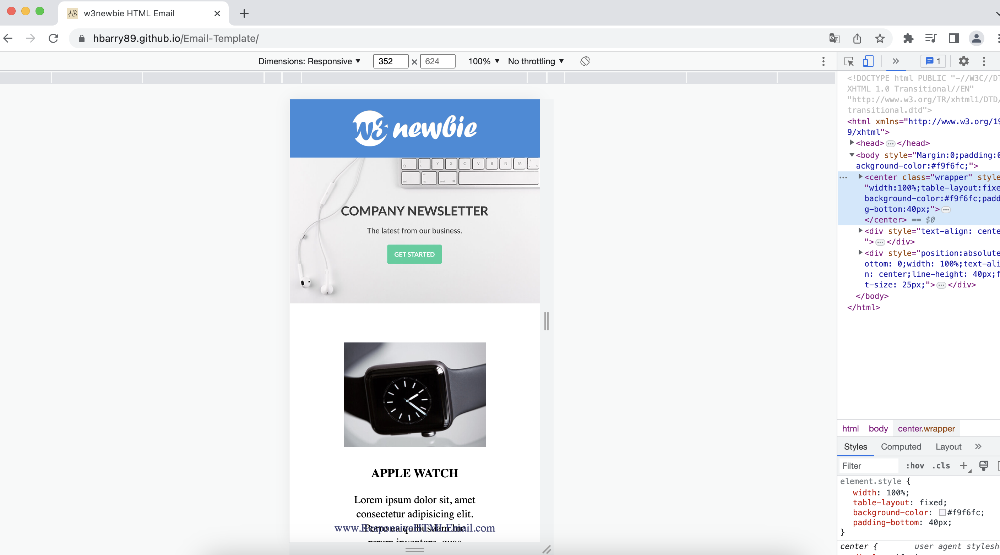
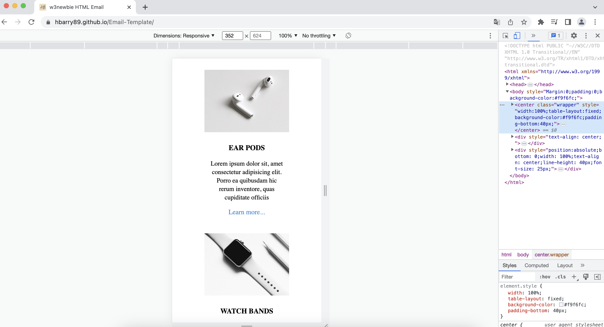
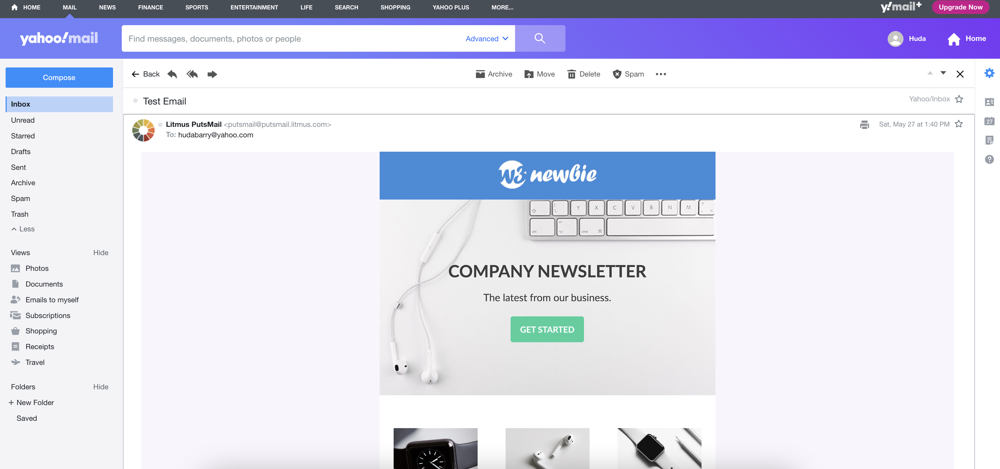
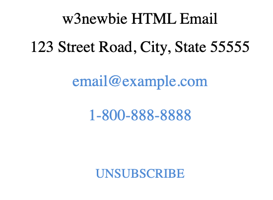

# Email Template

## :pencil: Description

- A sample responsive email template built with HTML and CSS for email development and digital marketing.
- Tested using Litmus: PutsMail.
- Following this [tutorial](https://www.youtube.com/watch?v=bWioL_nn9cI).

## :computer: Usage

[Click here](https://hbarry89.github.io/Email-Template/) for the live link.

### Preview

- Responsiveness:

------------------------------------------------------------------------------------

- Test Email sent through Litmus: Putsmail:

------------------------------------------------------------------------------------

- CAN-SPAM Compliant:

## :wrench: Technologies Used

- HTML
- CSS
- VS Code

## :star2: Features

- Responsiveness
- Deliverability

## :books: Resources

- [Tutorial](https://www.youtube.com/watch?v=bWioL_nn9cI) 
- [Litmus: Putsmail](https://putsmail.com/)

Thank you for visiting! :ribbon:

